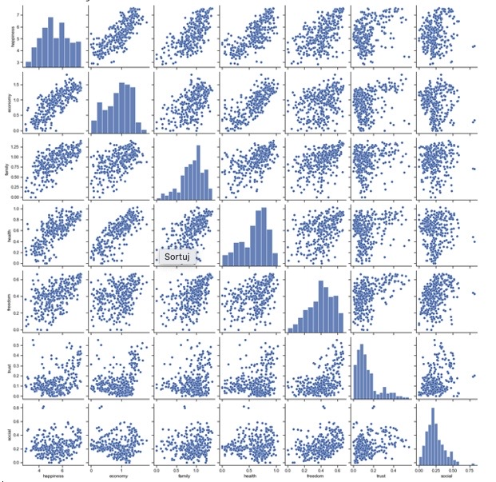
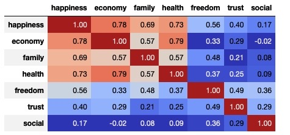
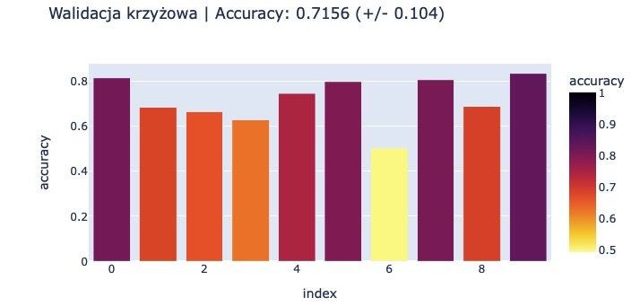
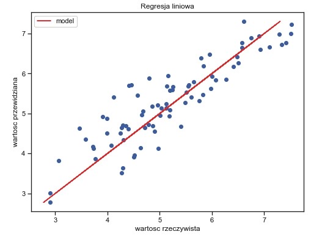

# Regresja

## Dane
Plik z danymi zawiera informacje z badan nad poziomem szczescia w poszczegolnych krajach. Liczba zmiennych: 8, w tym zmienna objasniana
'Happiness Score' - ilosciowa. Nie wszystkie zmienne z pliku zostana wykorzystane.
Dane zostaly pobrane z serwisu kaggle.com

## Informacje
Celem projektu jest zbudowanie modelu regresji, wyjasniajacego poziom szczescia w zaleznosci od istotnych zmiennych objasniajacyh np. sytuacji
ekonomicznej. Przetestowano rozne metody regresji.
Kod napisany w 2022 r. w języku Python 3.

## Pliki
- output.csv - plik z danymi
- Regresja.py - kod

## Przykladowe rezultaty dzialania programu

